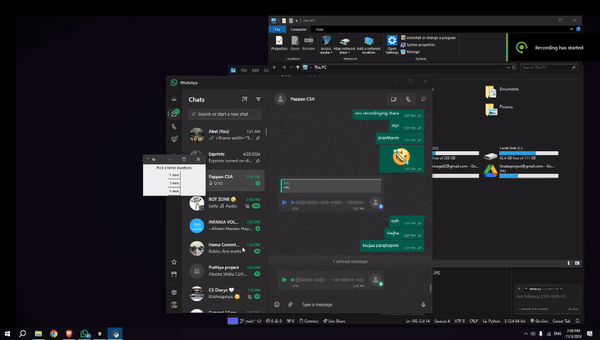
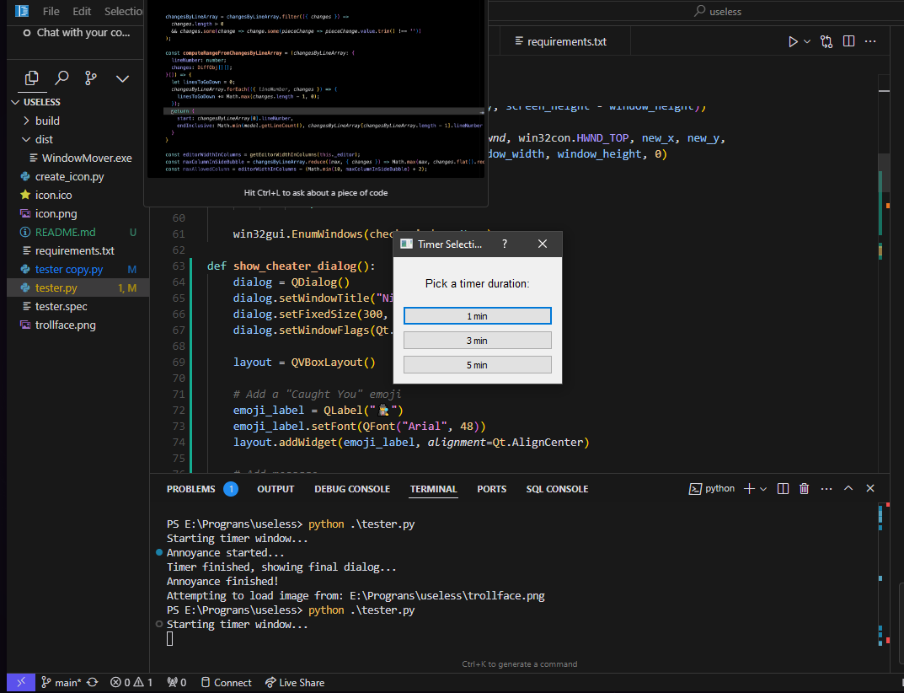

# I Like To Move It Move It 😏

A mischievous Windows application that playfully dodges your attempts to close windows. When you try to click the close button, the window will dance away from your cursor! 



## Demo Video 🎥

Watch how windows try to escape your cursor:

### Quick Preview


### Full Version
[Watch Full Version](https://github.com/Abelboby/move_it_move_it/issues/1#issue-2631222203)

## Download 📥

[Download Latest Release](https://github.com/Abelboby/move_it_move_it/releases/latest)

or direct download:

[Windows Executable (v1.0.0)](https://github.com/Abelboby/move_it_move_it/releases/download/on/i_like_to_move_it_move_it.exe)

## Features 🎯

- Window evasion technology (windows literally run away from you!)
- Customizable duration (1, 3, or 5 minutes of fun)
- Surprise ending with a special reward
- Completely portable - single executable file

## Screenshots 📸

### Timer Selection

*Choose how long you want the windows to play hard-to-get*

## How to Use 🎮

1. Download `i_like_to_move_it_move_it.exe` from the releases
2. Run the executable
3. Select your desired duration (1, 3, or 5 minutes)
4. Try to close any window... if you can! 😈
5. Enjoy the surprise when the timer ends

## Technical Details 🔧

- Built with Python and PyQt5
- Uses Win32 API for window manipulation
- Completely portable - no installation required
- Windows OS compatible

## Warning ⚠️

This is a joke application meant for entertainment purposes only. While active, it will make it difficult (but not impossible) to close windows. The application can be terminated through Task Manager if needed.

## Development 👨‍💻

Built using:
- Python 3.x
- PyQt5
- Win32GUI
- PyAutoGUI

## Building from Source 🛠️

If you want to build the executable yourself:

1. Clone the repository
2. Install requirements:
```bash
pip install -r requirements.txt
```
3. Build using PyInstaller:
```bash
pyinstaller tester.spec
```

## Acknowledgments 🙏

- Inspired by classic computer pranks
- Built for entertainment and learning purposes
- Special thanks to procrastination

## Note 📝

Remember, with great power comes great responsibility. Use this application wisely and only on willing participants! 

---
*Created with ❤️ and a bit of mischief*